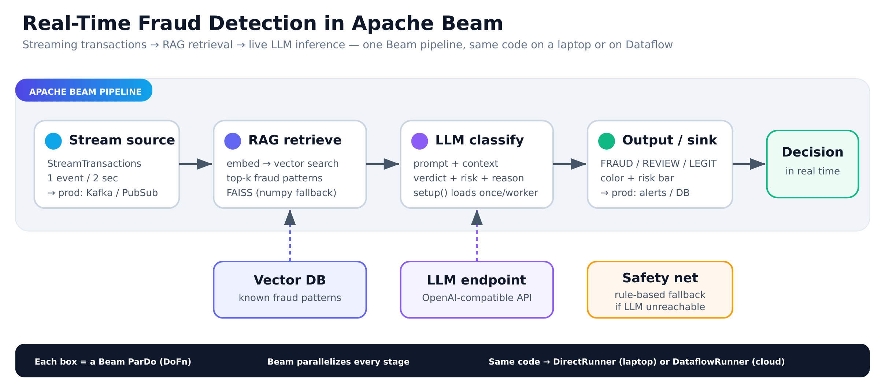

https://github.com/user-attachments/assets/89d7681b-7b81-4a49-8948-8893f42ff447

# Real-Time AI Pipelines at Scale — LLMs in Apache Beam


Embedding an LLM + RAG directly into an **Apache Beam** streaming pipeline for
live, per-event inference. A stream of credit-card transactions flows through the
pipeline; for each one it retrieves similar known fraud patterns from a vector
index (RAG), asks an LLM to classify it, and emits a verdict — **FRAUD / REVIEW /
LEGIT** — with a risk score and a reason, in real time.

Built as the live demo for the talk *"Real-Time AI Pipelines at Scale: Embedding
LLMs into Apache Beam for Live Inference"* (Beam Summit 2026).

> Runs on a laptop — no GPU, no cloud. Works with any OpenAI-compatible LLM
> endpoint, and degrades to a transparent rule-based classifier if the LLM is
> unreachable, so it never hard-fails.



*(Editable vector version: [architecture.svg](architecture.svg))*

## Demo

A short walkthrough of the live dashboard: transactions stream in, RAG retrieves
similar fraud patterns, the LLM classifies each one with a risk score and reason,
and pulling the model's plug falls back to rules without stopping the stream.

<video src="https://github.com/SamirSengupta/Apache-Beam-Summit-New-York-2026/raw/main/docs/demo_readme.mp4" controls width="100%"></video>

> If the player does not appear, the repo or branch in the URL above does not match
> yours. Edit it to `https://github.com/<user>/<repo>/raw/<branch>/docs/demo_readme.mp4`.
> The most reliable alternative is to open the README in the GitHub editor, drag
> `docs/demo_readme.mp4` into the text box, and paste the upload link it generates.

## Two versions

| File | What it shows | When to use |
|------|---------------|-------------|
| `realtime_fraud_rag_beam.py` | The core idea in the simplest readable form: four `DoFn`s — stream → RAG → LLM → print. | Easiest to read; the reliable live demo. |
| `advanced_pipeline.py` | The **Beam-native** version: `RunInference` + a custom `ModelHandler`, batched inference, fixed-window fraud-rate aggregation, Beam `Metrics`, and tagged FRAUD/cleared outputs. | The "production-shaped" walkthrough. |

Both share the same RAG/LLM logic, so the decisions are identical — only the Beam
wiring differs.

## How it works (core pipeline)

```
Create([None]) → StreamTransactions → RAG retrieve → LLM classify → print
   (seed)         (1 event / 2s)       (FAISS/numpy)   (OpenAI API)   (sink)
```

The pipeline is four Beam transforms (`ParDo` / `DoFn`):

1. **StreamTransactions** — emits one transaction every couple of seconds
   (stands in for a real `ReadFromKafka` / `ReadFromPubSub` source).
2. **RagRetrieve** — embeds the transaction and searches a vector index for the
   top-k most similar known fraud patterns.
3. **LlmClassify** — builds a prompt with the retrieved context and calls the
   LLM for a structured verdict.
4. **PrintResult** — the sink; pretty-prints the decision to the console.

Models and the vector index are loaded **once per worker** in `DoFn.setup()`, not
per element — the key cost pattern for ML in Beam.

## The Beam-native version (`advanced_pipeline.py`)

Same fraud detection, wired the way a production Beam pipeline would be:

- **`RunInference` + a custom `ModelHandler`** — the framework's standard way to
  serve a model in a pipeline. Beam calls `load_model()` once per worker and
  hands `run_inference()` a *batch* of elements.
- **Batched inference** — `batch_elements_kwargs` controls batch size, the lever
  for GPU saturation / cost.
- **Fixed-window aggregation** — a rolling fraud-rate computed per time window
  with event-time `TimestampedValue` + `FixedWindows`.
- **Beam `Metrics`** — counters (`transactions_total`, `frauds_detected`,
  `llm_fallbacks`) and distributions (`llm_latency_ms`, `risk_score`), queried
  after the run.
- **Tagged outputs** — the stream splits into a `fraud` branch and a `cleared`
  branch, each of which could feed its own sink.

```bash
python advanced_pipeline.py
```

## Quickstart

```bash
git clone https://github.com/SamirSengupta/Apache-Beam-Summit-New-York-2026.git
cd Apache-Beam-Summit-New-York-2026

python -m venv .venv
source .venv/bin/activate        # Windows: .venv\Scripts\activate
pip install -r requirements.txt

python realtime_fraud_rag_beam.py        # simple version
python advanced_pipeline.py              # Beam-native version
```

Want to verify the logic without Beam or a live LLM?

```bash
python realtime_fraud_rag_beam.py --selftest
```

## Configuration

All settings are environment variables (with sensible defaults), so nothing is
hard-coded. The LLM call uses only Python's standard library — **no `openai`
package required**. Point it at any OpenAI-compatible endpoint:

| Variable | Default | Notes |
|----------|---------|-------|
| `LLM_BASE_URL` | `http://127.0.0.1:8317/v1` | Any OpenAI-compatible base URL |
| `LLM_MODEL` | `claude-opus-4-6-thinking` | Model name your endpoint serves |
| `LLM_API_KEY` | `dummy` | Bearer token (use a real key for hosted APIs) |
| `STREAM_DELAY` | `2.0` | Seconds between streamed events |

Examples for common backends:

```bash
# OpenAI
LLM_BASE_URL=https://api.openai.com/v1 LLM_MODEL=gpt-4o-mini LLM_API_KEY=sk-... \
  python realtime_fraud_rag_beam.py

# Ollama (local)
LLM_BASE_URL=http://localhost:11434/v1 LLM_MODEL=llama3.1 \
  python realtime_fraud_rag_beam.py

# vLLM / LM Studio / any local proxy
LLM_BASE_URL=http://localhost:8000/v1 LLM_MODEL=your-model \
  python realtime_fraud_rag_beam.py
```

If the endpoint is unreachable, the pipeline logs a notice and falls back to a
rule-based classifier — output is tagged `(fallback)` instead of `(LLM)`.

## From demo to production

The same transforms run unchanged at scale; only the plugged-in components grow:

| In this demo | In production |
|--------------|---------------|
| Generator emits events on a timer | `ReadFromKafka` / `ReadFromPubSub` |
| Hashing embedder + FAISS/numpy index | Real embeddings + Pinecone / FAISS at scale |
| Local OpenAI-compatible endpoint | vLLM / AWS Bedrock + SageMaker |
| `DirectRunner` on a laptop | `DataflowRunner` + Kubernetes |

To use real semantic embeddings, swap the `HashingEmbedder` class for
`sentence-transformers` (`all-MiniLM-L6-v2`) or a hosted embedding API — nothing
else in the pipeline changes.

## Repo structure

```
.
├── realtime_fraud_rag_beam.py   # core demo (4 DoFns, heavily commented)
├── advanced_pipeline.py         # Beam-native: RunInference, windowing, metrics
├── requirements.txt             # apache-beam, numpy (faiss optional)
├── architecture.png             # pipeline diagram (rendered, for viewing)
├── architecture.svg             # pipeline diagram (editable vector source)
├── README.md
├── LICENSE
└── docs/
    ├── PRESENTER_GUIDE.md        # plain-English walkthrough + speaker notes
    ├── NotebookLM_Source_Full.md # narrative source for an audio overview
    └── Beam_Summit_2026_Talk.pptx# slide deck
```

## Requirements

Python 3.9+, `apache-beam` and `numpy`. `faiss-cpu` is optional — the demo
automatically uses a numpy fallback if it isn't installed. `RunInference` ships
with core `apache-beam`; no extra package is needed.

## License

MIT — see [LICENSE](LICENSE).
