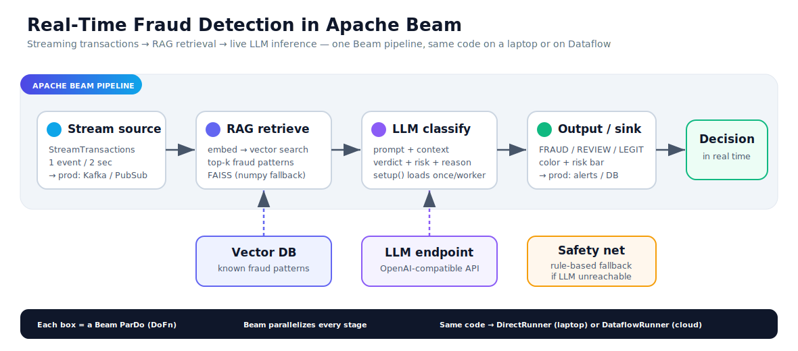

# Real-Time AI Pipelines at Scale — LLMs in Apache Beam

Embedding an LLM + RAG directly into an **Apache Beam** streaming pipeline for
live, per-event inference. A stream of credit-card transactions flows through the
pipeline; for each one it retrieves similar known fraud patterns from a vector
index (RAG), asks an LLM to classify it, and emits a verdict — **FRAUD / REVIEW /
LEGIT** — with a risk score and a reason, in real time.

Built as the live demo for the talk *"Real-Time AI Pipelines at Scale: Embedding
LLMs into Apache Beam for Live Inference"* (Beam Summit 2026).

> Runs on a laptop — no GPU, no cloud. Works with any OpenAI-compatible LLM
> endpoint, and degrades to a transparent rule-based classifier if the LLM is
> unreachable, so it never hard-fails.



## How it works

```
Create([None]) → StreamTransactions → RAG retrieve → LLM classify → print
   (seed)         (1 event / 2s)       (FAISS/numpy)   (OpenAI API)   (sink)
```

The pipeline is four Beam transforms (`ParDo` / `DoFn`):

1. **StreamTransactions** — emits one transaction every couple of seconds
   (stands in for a real `ReadFromKafka` / `ReadFromPubSub` source).
2. **RagRetrieve** — embeds the transaction and searches a vector index for the
   top-k most similar known fraud patterns.
3. **LlmClassify** — builds a prompt with the retrieved context and calls the
   LLM for a structured verdict.
4. **PrintResult** — the sink; pretty-prints the decision to the console.

Models and the vector index are loaded **once per worker** in `DoFn.setup()`, not
per element — the key cost pattern for ML in Beam.

## Quickstart

```bash
git clone <your-repo-url>
cd <repo>

python -m venv .venv
source .venv/bin/activate        # Windows: .venv\Scripts\activate
pip install -r requirements.txt

python realtime_fraud_rag_beam.py
```

Want to verify the logic without Beam or a live LLM?

```bash
python realtime_fraud_rag_beam.py --selftest
```

## Configuration

All settings are environment variables (with sensible defaults), so nothing is
hard-coded. The LLM call uses only Python's standard library — **no `openai`
package required**. Point it at any OpenAI-compatible endpoint:

| Variable | Default | Notes |
|----------|---------|-------|
| `LLM_BASE_URL` | `http://127.0.0.1:8317/v1` | Any OpenAI-compatible base URL |
| `LLM_MODEL` | `claude-opus-4-6-thinking` | Model name your endpoint serves |
| `LLM_API_KEY` | `dummy` | Bearer token (use a real key for hosted APIs) |
| `STREAM_DELAY` | `2.0` | Seconds between streamed events |

Examples for common backends:

```bash
# OpenAI
LLM_BASE_URL=https://api.openai.com/v1 LLM_MODEL=gpt-4o-mini LLM_API_KEY=sk-... \
  python realtime_fraud_rag_beam.py

# Ollama (local)
LLM_BASE_URL=http://localhost:11434/v1 LLM_MODEL=llama3.1 \
  python realtime_fraud_rag_beam.py

# vLLM / LM Studio / any local proxy
LLM_BASE_URL=http://localhost:8000/v1 LLM_MODEL=your-model \
  python realtime_fraud_rag_beam.py
```

If the endpoint is unreachable, the pipeline logs a notice and falls back to a
rule-based classifier — output is tagged `(fallback)` instead of `(LLM)`.

## From demo to production

The same five transforms run unchanged at scale; only the plugged-in components
grow:

| In this demo | In production |
|--------------|---------------|
| Generator emits events on a timer | `ReadFromKafka` / `ReadFromPubSub` |
| Hashing embedder + FAISS/numpy index | Real embeddings + Pinecone / FAISS at scale |
| Local OpenAI-compatible endpoint | vLLM / AWS Bedrock + SageMaker |
| `DirectRunner` on a laptop | `DataflowRunner` + Kubernetes |

To use real semantic embeddings, swap the `HashingEmbedder` class for
`sentence-transformers` (`all-MiniLM-L6-v2`) or a hosted embedding API — nothing
else in the pipeline changes.

## Repo structure

```
.
├── realtime_fraud_rag_beam.py   # the entire demo (heavily commented)
├── requirements.txt             # apache-beam, numpy (faiss optional)
├── architecture.svg             # pipeline diagram
├── README.md
├── LICENSE
└── docs/
    ├── PRESENTER_GUIDE.md        # plain-English walkthrough + speaker notes
    ├── NotebookLM_Source_Full.md # narrative source for an audio overview
    └── Beam_Summit_2026_Talk.pptx# slide deck
```

## Requirements

Python 3.9+, `apache-beam` and `numpy`. `faiss-cpu` is optional — the demo
automatically uses a numpy fallback if it isn't installed.

## License

MIT — see [LICENSE](LICENSE).
